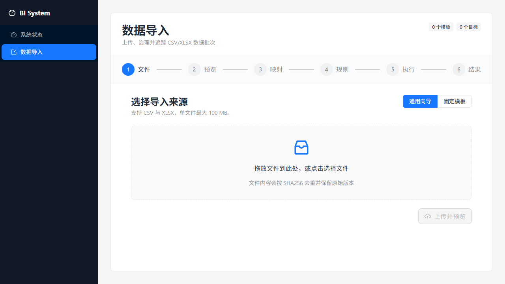
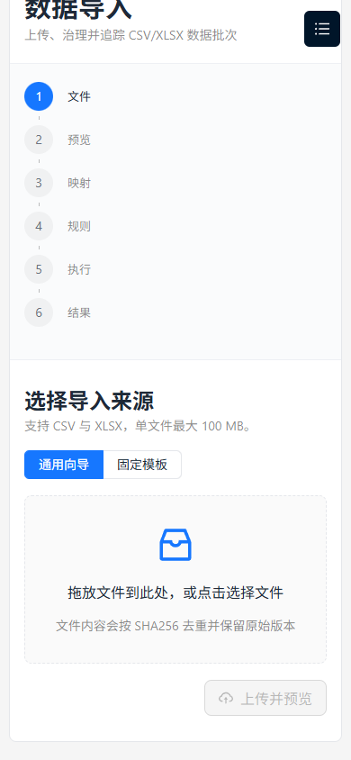

# M1 Data Ingestion Verification

Verified on 2026-07-15 on Windows 11 with Python 3.13.11, Node.js 24.11.1, npm 11.18.0, SQLite, and PostgreSQL 18.1.

## Outcome

M1 is accepted. CSV and XLSX ingestion now covers content-addressed upload, bounded preview, versioned templates, inline mapping, typed quality rules, append/replace/upsert targets, warning confirmation, cancellation, checkpoint retry, issue samples, complete UTF-8 BOM reports, and storage cleanup. The React workspace exposes the same lifecycle with Ant Design controls and polling.

## Functional Evidence

| Scenario | Evidence | Result |
| --- | --- | --- |
| Generic CSV upload, preview, and duplicate reuse | `test_source_files.py`; browser upload of `m1-ui-sample.csv` | Pass |
| Fixed-template XLSX import | `test_worker_imports_xlsx_using_stored_template` | Pass on SQLite and PostgreSQL |
| Append, replace, and business-key upsert | `test_worker_supports_append_replace_and_upsert` | Pass |
| Blocking errors and complete report | `test_quality_errors_block_activation_and_store_samples` | Pass |
| Warning confirmation | `test_warning_confirmation_requeues_and_commits_rows` | Pass |
| Cancellation without visible partial rows | `test_processing_cancellation_discards_staging` | Pass |
| Process-stop recovery from checkpoint | `test_worker_resumes_after_committed_checkpoint` | Pass |
| PostgreSQL claim and dynamic target portability | `test_batch_portability.py` | Pass |
| Desktop and 390 px frontend states | Vitest and Playwright CLI | Pass; no console errors |

## Scale Result

The benchmark uses the real source registration, batch, quality evaluator, dynamic SQLite target, worker, 2,000-row checkpoints, and concurrent `/api/v1/health/ready` requests.

| Rows | CSV size | Import time | Throughput | Python heap peak | Ready checks | Failures |
| ---: | ---: | ---: | ---: | ---: | ---: | ---: |
| 100,000 | 3,789,037 B | 35.00 s | 2,857 rows/s | 4.51 MB | 380 | 0 |
| 1,000,000 | 37,890,037 B | 412.22 s | 2,426 rows/s | 4.69 MB | 5,020 | 0 |

The 10x row increase added 0.18 MB of traced Python heap. Disk-backed duplicate tracking replaced the previous unbounded in-memory key sets. The million-row run produced 1,000,000 active rows; maximum readiness latency was 275.97 ms.

Reproduce with:

```powershell
uv run python scripts/benchmark_m1_ingestion.py --rows 1000000 --chunk-rows 2000
```

## Verification Commands

```powershell
uv run pytest backend/tests -q --cov=bi_system
uv run python scripts/run_postgres_tests.py
uv run ruff check backend scripts
uv run ruff format --check backend scripts
uv run basedpyright backend/src backend/tests scripts
npm --prefix frontend run check
npm --prefix frontend run build
uv run pre-commit run --all-files
```

Final results: 91 SQLite tests at 90% coverage, 30 PostgreSQL integration tests with migration downgrade/re-upgrade, 8 frontend tests, and all static checks passed. The only non-blocking notices are Starlette's TestClient dependency deprecation and Vite's initial bundle-size warning already tracked in ADR 0001.

## Browser Evidence

Desktop, 1280 x 720:



Mobile, 390 x 844:


