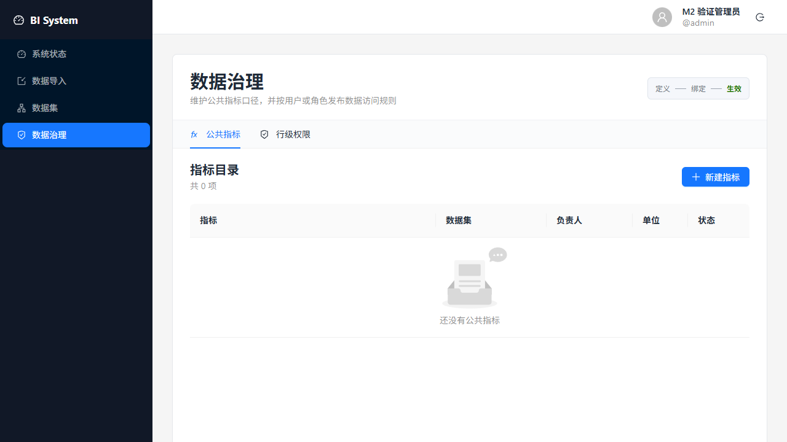

# M2 Data Modeling Verification

Verified on 2026-07-17 on Windows 11 with Python 3.13.11, Node.js 24.11.1, npm 11.18.0, SQLite, and PostgreSQL 18.1.

## Outcome

M2 is accepted. Data modeling now covers governed semantic models, datasets, multi-source joins, reusable metrics, calculated fields, row-level policies, query validation, query execution deadlines, and same-origin frontend access. SQLite remains the lightweight local target; PostgreSQL is the concurrency and production compatibility target.

## Functional Evidence

| Scenario | Evidence | Result |
| --- | --- | --- |
| INNER and LEFT joins | `test_multi_source_queries.py`; `test_dataset_queries.py` | Pass |
| One-to-one and many-to-one cardinality | `test_multi_source_query_executes_one_to_one_cardinality` | Pass |
| Compound join keys and active-row filters | `test_multi_source_query_preserves_left_and_enforces_inner_compound_and_active_filters` | Pass |
| Metrics and calculated fields | `test_metric_portability.py`; `test_calculated_fields_api.py` | Pass |
| Row-level policy before aggregation | `test_metric_portability.py`; `test_row_policy_portability.py` | Pass on SQLite and PostgreSQL |
| Date, Boolean, NULL, and ordering portability | `test_metric_portability.py` | Pass |
| Query timeout behavior | `test_query_timeout.py`; `test_query_timeout_portability.py` | Pass |
| Same-origin API proxy and Cookie refresh | Browser verification with Vite proxy | Pass; no console errors |

## PostgreSQL Scale Result

The benchmark uses a generated three-source star model, 100,000 fact rows, two 100-row dimensions, governed query compilation, grouping, aggregation, source batch collection, and a PostgreSQL schema isolated per run. The benchmark engine now sizes its connection pool to the requested concurrency so the result measures query work rather than pool starvation.

```powershell
uv run python scripts/benchmark_m2_queries.py --database-url postgresql+psycopg://bi_system@127.0.0.1:55433/bi_system_benchmark --rows 100000 --concurrency 20 --iterations 1 --timeout-seconds 30
```

| Dialect | Rows | Concurrency | Completed | Errors | P50 | P95 | Throughput | Wall time |
| --- | ---: | ---: | ---: | ---: | ---: | ---: | ---: | ---: |
| PostgreSQL | 100,000 | 20 | 20 | 0 | 5,091.655 ms | 6,949.637 ms | 2.474 rps | 8.083 s |

SQLite 20-concurrency runs are not a production signal and are intentionally excluded from acceptance. ADR 0002 keeps SQLite scoped to local single-user correctness.

## Verification Commands

```powershell
uv run pytest backend/tests -q --cov=bi_system
uv run python scripts/run_postgres_tests.py
uv run ruff check backend scripts
uv run ruff format --check backend scripts
uv run basedpyright backend/src backend/tests scripts
npm --prefix frontend run check
npm --prefix frontend run build
uv run pre-commit run --all-files
```

Final results: 225 backend tests at 91% coverage, 70 PostgreSQL integration tests with migration downgrade/re-upgrade, 34 frontend tests, desktop/mobile browser checks, and all static checks passed. The first frontend check run was resource-contended while build ran in parallel; the isolated rerun passed.

## Browser Evidence

Desktop, 1280 x 720:



Mobile, 390 x 844:


